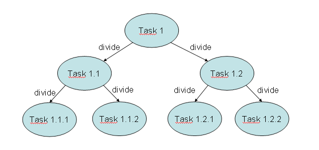

## Fork/Join vs Executor 区别

This framework is designed to solve problems that can be broken into smaller tasks using
the divide and conquer technique. Inside a task, you check the size of the problem you want
to resolve and, if it's bigger than an established size, you divide it in smaller tasks that are
executed using the framework. If the size of the problem is smaller than the established size,
you solve the problem directly in the task and then, optionally, it returns a result. The following diagram summarizes this concept:



There is no formula to determine the reference size of a problem that determines if a task
is subdivided or not, depending on its characteristics. You can use the number of elements
to process in the task and an estimation of the execution time to determine the reference
size. Test different reference sizes to choose the best one to your problem. You can consider
ForkJoinPool as a special kind of  Executor .
The framework is based on the following two operations:

- The fork operation: When you divide a task into smaller tasks and execute them
using the framework
- The join operation: When a task waits for the finalization of the tasks it has created

The main difference between the Fork/Join and the Executor frameworks is the work-stealing
algorithm. Unlike the Executor framework, when a task is waiting for the finalization of the
subtasks it has created using the join operation, the thread that is executing that task (called
worker thread) looks for other tasks that have not been executed yet and begins its execution.
By this way, the threads take full advantage of their running time, thereby improving the
performance of the application.
To achieve this goal, the tasks executed by the Fork/Join framework have the
following limitations:

- Tasks can only use the  fork() and  join() operations as synchronization
mechanisms. If they use other synchronization mechanisms, the worker threads
can't execute other tasks when they are in the synchronization operation. For
example, if you put a task to sleep in the Fork/Join framework, the worker thread
that is executing that task won't execute another one during the sleeping time.
- Tasks should not perform I/O operations, such as read or write data in a file.
- Tasks can't throw checked exceptions. It has to include the code necessary
to process them.


The core of the Fork/Join framework is formed by the following two classes:
- ForkJoinPool : It implements the  ExecutorService interface and the work-
stealing algorithm. It manages the worker threads and offers information about the
status of the tasks and their execution.
- ForkJoinTask : It's the base class of the tasks that will execute in  ForkJoinPool .
It provides the mechanisms to execute the  fork() and  join() operations inside
a task and the methods to control the status of the tasks. Usually, to implement
your Fork/Join tasks, you will implement a subclass of two subclasses of this class:
RecursiveAction for tasks with no return result and  RecursiveTask for tasks
that return one.


## Creating a Fork/Join pool

- Main.java

```java
/**
 * Main class of the example. It creates a list of products, a ForkJoinPool and 
 * a task to execute the actualization of products. 
 *
 */
public class Main {

	/**
	 * Main method of the example
	 * @param args
	 */
	public static void main(String[] args) {

		// Create a list of products
		ProductListGenerator generator=new ProductListGenerator();
		List<Product> products=generator.generate(10000);
		
		// Craete a task
		Task task=new Task(products, 0, products.size(), 0.20);
		
		// Create a ForkJoinPool
		ForkJoinPool pool=new ForkJoinPool();
		
		// Execute the Task
		pool.execute(task);

		// Write information about the pool
		do {
			System.out.printf("Main: Thread Count: %d\n",pool.getActiveThreadCount());
			System.out.printf("Main: Thread Steal: %d\n",pool.getStealCount());
			System.out.printf("Main: Paralelism: %d\n",pool.getParallelism());
			try {
				TimeUnit.MILLISECONDS.sleep(5);
			} catch (InterruptedException e) {
				e.printStackTrace();
			}
		} while (!task.isDone());
	
		// Shutdown the pool
		pool.shutdown();
		
		// Check if the task has completed normally
		if (task.isCompletedNormally()){
			System.out.printf("Main: The process has completed normally.\n");
		}

		// Expected result: 12. Write products which price is not 12
		for (int i=0; i<products.size(); i++){
			Product product=products.get(i);
			if (product.getPrice()!=12) {
				System.out.printf("Product %s: %f\n",product.getName(),product.getPrice());
			}
		}
		
		// End of the program
		System.out.println("Main: End of the program.\n");

	}

}
```

- Task.java

```java
/**
 * This class implements the tasks that are going to update the
 * price information. If the assigned interval of values is less that 10, it
 * increases the prices of the assigned products. In other case, it divides
 * the assigned interval in two, creates two new tasks and execute them
 *
 */
public class Task extends RecursiveAction {

	/**
	 * serial version UID. The ForkJoinTask class implements the serializable interface.
	 */
	private static final long serialVersionUID = 1L;

	/**
	 * List of products
	 */
	private List<Product> products;
	
	/**
	 * Fist and Last position of the interval assigned to the task
	 */
	private int first;
	private int last;
	
	/**
	 * Increment in the price of products this task has to apply
	 */
	private double increment;
	
	/**
	 * Constructor of the class. Initializes its attributes
	 * @param products list of products
	 * @param first first element of the list assigned to the task
	 * @param last last element of the list assigned to the task
	 * @param increment price increment that this task has to apply
	 */
	public Task (List<Product> products, int first, int last, double increment) {
		this.products=products;
		this.first=first;
		this.last=last;
		this.increment=increment;
	}
	
	/**
	 * Method that implements the job of the task
	 */
	@Override
	protected void compute() {
		if (last-first<10) {
			updatePrices();
		} else {
			int middle=(last+first)/2;
			System.out.printf("Task: Pending tasks: %s\n",getQueuedTaskCount());
			Task t1=new Task(products, first,middle+1, increment);
			Task t2=new Task(products, middle+1,last, increment);
			invokeAll(t1, t2);	
		}
	}

	/**
	 * Method that updates the prices of the assigned products to the task
	 */
	private void updatePrices() {
		for (int i=first; i<last; i++){
			Product product=products.get(i);
			product.setPrice(product.getPrice()*(1+increment));
		}
	}

}
```

- Product.java

```java
/**
 * This class stores the data of a Product. It's name and it's price
 *
 */
public class Product {
	
	/**
	 * Name of the product
	 */
	private String name;
	
	/**
	 * Price of the product
	 */
	private double price;
	
	/**
	 * This method returns the name of the product
	 * @return the name of the product
	 */
	public String getName() {
		return name;
	}
	
	/**
	 * This method establish the name of the product
	 * @param name the name of the product
	 */
	public void setName(String name) {
		this.name = name;
	}
	
	/**
	 * This method returns the price of the product
	 * @return the price of the product
	 */
	public double getPrice() {
		return price;
	}
	
	/**
	 * This method establish the price of the product
	 * @param price the price of the product
	 */
	public void setPrice(double price) {
		this.price = price;
	}

}
```

- ProductListGenerator.java

```java
/**
 * This class generates a product list of a determined size.
 * Each product is initialized with a predefined name and price.
 *
 */
public class ProductListGenerator {

	/**
	 * This method generates the list of products
	 * @param size the size of the product list
	 * @return the generated list of products
	 */
	public List<Product> generate (int size) {
		List<Product> ret=new ArrayList<Product>();
		
		for (int i=0; i<size; i++){
			Product product=new Product();
			product.setName("Product "+i);
			product.setPrice(10);
			ret.add(product);
		}
		
		return ret;
	}

}
```

- 输出结果: 任务继承了`RecursiveAction`,重写`compute()`方法,之后用`ForkJoinPool` 特有的线程池执行任务

In this example, you have created a  ForkJoinPool object and a subclass of the
ForkJoinTask class that you execute in the pool. To create the  ForkJoinPool object,
you have used the constructor without arguments, so it will be executed with its default
configuration. It creates a pool with a number of threads equal to the number of processors
of the computer. When the  ForkJoinPool object is created, those threads are created and
they wait in the pool until some tasks arrive for their execution.

Since the  Task class doesn't return a result, it extends the  RecursiveAction class. In the
recipe, you have used the recommended structure for the implementation of the task. If the
task has to update more than 10 products, it divides those set of elements into two blocks,
creates two tasks, and assigns a block to each task. You have used the  first and  last
attributes in the  Task class to know the range of positions that this task has to update in the
list of products. You have used the  first and  last attributes to use only one copy of the
products list and not create different lists for each task.

To execute the subtasks that a task creates, it calls the  invokeAll() method. This is a
synchronous call, and the task waits for the finalization of the subtasks before continuing
(potentially finishing) its execution. While the task is waiting for its subtasks, the worker thread
that was executing it takes another task that was waiting for execution and executes it. With
this behavior, the Fork/Join framework offers a more efficient task management than the
Runnable and  Callable objects themselves.

The  invokeAll() method of the  ForkJoinTask class is one of the main differences
between the Executor and the Fork/Join framework. In the Executor framework, all the tasks
have to be sent to the executor, while in this case, the tasks include methods to execute and
control the tasks inside the pool. You have used the  invokeAll() method in the  Task class,
that extends the  RecursiveAction class that extends the  ForkJoinTask class.

You have sent a unique task to the pool to update all the list of products using the  execute()
method. In this case, it's an asynchronous call, and the main thread continues its execution.

You have used some methods of the  ForkJoinPool class to check the status and the
evolution of the tasks that are running. The class includes more methods that can be useful
for this purpose. See the Monitoring a Fork/Join pool recipe for a complete list of
those methods.

Finally, like with the Executor framework, you should finish  ForkJoinPool using the
shutdown() method.


## Joining the results of the tasks

- Main.java

```java
/**
 * Main class of the example. 
 */
public class Main {

	/**
	 * Main method of the class
	 */
	public static void main(String[] args) {
		
		// Generate a document with 100 lines and 1000 words per line
		DocumentMock mock=new DocumentMock();
		String[][] document=mock.generateDocument(100, 1000, "the");
	
		// Create a DocumentTask
		DocumentTask task=new DocumentTask(document, 0, 100, "the");
		
		// Create a ForkJoinPool
		ForkJoinPool pool=new ForkJoinPool();
		
		// Execute the Task
		pool.execute(task);
		
		// Write statistics about the pool
		do {
			System.out.printf("******************************************\n");
			System.out.printf("Main: Parallelism: %d\n",pool.getParallelism());
			System.out.printf("Main: Active Threads: %d\n",pool.getActiveThreadCount());
			System.out.printf("Main: Task Count: %d\n",pool.getQueuedTaskCount());
			System.out.printf("Main: Steal Count: %d\n",pool.getStealCount());
			System.out.printf("******************************************\n");

			try {
				TimeUnit.SECONDS.sleep(1);
			} catch (InterruptedException e) {
				e.printStackTrace();
			}
			
		} while (!task.isDone());

		// Shutdown the pool
		pool.shutdown();
		
		// Wait for the finalization of the tasks
		try {
			pool.awaitTermination(1, TimeUnit.DAYS);
		} catch (InterruptedException e) {
			e.printStackTrace();
		}
		
		// Write the results of the tasks
		try {
			System.out.printf("Main: The word appears %d in the document",task.get());
		} catch (InterruptedException | ExecutionException e) {
			e.printStackTrace();
		}
	}

}	
```

- DocumentTask.java

```java
/**
 * Task that will process part of the document and calculate the number of 
 * appearances of the word in that block. If it has to process
 * more that 10 lines, it divides its part in two and throws two DocumentTask
 * to calculate the number of appearances in each block.
 * In other case, it throws LineTasks to process the lines of the block
 *
 */
public class DocumentTask extends RecursiveTask<Integer> {

	/**
	 * Serial Version of the class. You have to include it because
	 * the ForkJoinTask class implements the Serializable interface
	 */
	private static final long serialVersionUID = 1L;
	
	/**
	 * Document to process
	 */
	private String document[][];
	
	/**
	 * Range of lines of the document this task has to process
	 */
	private int start, end;
	
	/**
	 * Word we are looking for
	 */
	private String word;
	
	/**
	 * Constructor of the class
	 * @param document Document to process
	 * @param start Starting position of the block of the document this task has to process
	 * @param end End position of the block of the document this task has to process
	 * @param word Word we are looking for
	 */
	public DocumentTask (String document[][], int start, int end, String word){
		this.document=document;
		this.start=start;
		this.end=end;
		this.word=word;
	}
	
	/**
	 * If the task has to process more that ten lines, it divide
	 * the block of lines it two subblocks and throws two DocumentTask
	 * two process them.
	 * In other case, it throws LineTask tasks to process each line of its block
	 */
	@Override
	protected Integer compute() {
		Integer result=null;
		if (end-start<10){
			result=processLines(document, start,end,word);
		} else {
			int mid=(start+end)/2;
			DocumentTask task1=new DocumentTask(document,start,mid,word);
			DocumentTask task2=new DocumentTask(document,mid,end,word);
			invokeAll(task1,task2);
			try {
				result=groupResults(task1.get(),task2.get());
			} catch (InterruptedException | ExecutionException e) {
				e.printStackTrace();
			}
		}
		return result;
	}

	/**
	 * Throws a LineTask task for each line of the block of lines this task has to process
	 * @param document Document to process
	 * @param start Starting position of the block of lines it has to process
	 * @param end Finish position of the block of lines it has to process
	 * @param word Word we are looking for
	 * @return
	 */
	private Integer processLines(String[][] document, int start, int end,
			String word) {
		List<LineTask> tasks=new ArrayList<LineTask>();
		
		for (int i=start; i<end; i++){
			LineTask task=new LineTask(document[i], 0, document[i].length, word);
			tasks.add(task);
		}
		invokeAll(tasks);
		
		int result=0;
		for (int i=0; i<tasks.size(); i++) {
			LineTask task=tasks.get(i);
			try {
				result=result+task.get();
			} catch (InterruptedException | ExecutionException e) {
				e.printStackTrace();
			}
		}
		return new Integer(result);
	}

	/**
	 * Method that group the results of two DocumentTask tasks
	 * @param number1 Result of the first DocumentTask
	 * @param number2 Result of the second DocumentTask
	 * @return The sum of the two results
	 */
	private Integer groupResults(Integer number1, Integer number2) {
		Integer result;
		
		result=number1+number2;
		return result;
	}
	
	
}
```

- LineTask.jav

```java
/**
 * Task that will process a fragment of a line of the document. If the 
 * fragment is too big (100 words or more), it split it in two parts
 * and throw to tasks to process each of the fragments.
 * 
 * It returns the number of appearances of the word in the fragment it has
 * to process.
 *
 */
public class LineTaskLineTask.jav extends RecursiveTask<Integer>{

	/**
	 * Serial Version of the class. You have to add it because the
	 * ForkJoinTask class implements the serializable interface
	 */
	private static final long serialVersionUID = 1L;
	
	/**
	 * A line of the document
	 */
	private String line[];
	
	/**
	 * Range of positions the task has to process
	 */
	private int start, end;
	
	/**
	 * Word we are looking for
	 */
	private String word;
	
	/**
	 * Constructor of the class
	 * @param line A line of the document
	 * @param start Position of the line where the task starts its process
	 * @param end Position of the line where the task starts its process
	 * @param word Work we are looking for
	 */
	public LineTask(String line[], int start, int end, String word) {
		this.line=line;
		this.start=start;
		this.end=end;
		this.word=word;
	}

	/**
	 * If the part of the line it has to process is smaller that 100, it
	 * calculates the number of appearances of the word in the block. Else,
	 * it divides the block in two blocks and throws to LineTask to calculate
	 * the number of appearances.
	 */
	@Override
	protected Integer compute() {
		Integer result=null;
		if (end-start<100) {
			result=count(line, start, end, word);
		} else {
			int mid=(start+end)/2;
			LineTask task1=new LineTask(line, start, mid, word);
			LineTask task2=new LineTask(line, mid, end, word);
			invokeAll(task1, task2);
			try {
				result=groupResults(task1.get(),task2.get());
			} catch (InterruptedException | ExecutionException e) {
				e.printStackTrace();
			}
		}
		return result;
	}

	/**
	 * Groups the results of two LineTasks
	 * @param number1 The result of the first LineTask
	 * @param number2 The result of the second LineTask
	 * @return The sum of the numbers
	 */
	private Integer groupResults(Integer number1, Integer number2) {
		Integer result;
		
		result=number1+number2;
		return result;
	}

	/**
	 * Count the appearances of a word in a part of a line of a document
	 * @param line A line of the document
	 * @param start Position of the line where the method begin to count
	 * @param end Position of the line where the method finish the count
	 * @param word Word the method looks for
	 * @return The number of appearances of the word in the part of the line
	 */
	private Integer count(String[] line, int start, int end, String word) {
		int counter;
		counter=0;
		for (int i=start; i<end; i++){
			if (line[i].equals(word)){
				counter++;
			}
		}
		try {
			TimeUnit.MILLISECONDS.sleep(10);
		} catch (InterruptedException e) {
			e.printStackTrace();
		}
		return counter;
	}
	
	

}
```

- DocumentMock.java

```java
/**
 * This class will simulate a document generating a String array with a determined number
 * of rows (numLines) and columns(numWords). The content of the document will be generated
 * selecting in a random way words from a String array.
 *
 */
public class DocumentMock {
	
	/**
	 * String array with the words of the document
	 */
	private String words[]={"the","hello","goodbye","packt","java","thread","pool","random","class","main"};

	/**
	 * Method that generates the String matrix
	 * @param numLines Number of lines of the document
	 * @param numWords Number of words of the document
	 * @param word Word we are going to search for
	 * @return The String matrix
	 */
	public String[][] generateDocument(int numLines, int numWords, String word){
		
		int counter=0;
		String document[][]=new String[numLines][numWords];
		Random random=new Random();
		for (int i=0; i<numLines; i++){
			for (int j=0; j<numWords; j++) {
				int index=random.nextInt(words.length);
				document[i][j]=words[index];
				if (document[i][j].equals(word)){
					counter++;
				}
			}
		}
		System.out.printf("DocumentMock: The word appears %d times in the document.\n",counter);
		return document;
	}
}
```

- 输出结果: 分了两个任务,一个搜每个文章,一个搜每行.继承了 `RecursiveTask<Integer>`, 重写`compute()`方法,


The Fork/Join framework provides the ability of executing tasks that return a result.
These kinds of tasks are implemented by the  RecursiveTask class. This class extends
the  ForkJoinTask class and implements the  Future interface provided by the
Executor framework.
Inside the task, you have to use the structure recommended by the Java API documentation:

```
If (problem size > size){
tasks=Divide(task);
execute(tasks);
groupResults()
return result;
} else {
resolve problem;
return result;
}

```

If the task has to resolve a problem bigger than a predefined size, you divide the problem in
more subtasks and execute those subtasks using the Fork/Join framework. When they finish
their execution, the initiating task obtains the results generated by all the subtasks, groups
them, and returns the final result. Ultimately, when the initiating task executed in the pool
finishes its execution, you obtain its result that is effectively the final result of the entire problem.


- The  DocumentTask class: A task of this class has to process a set of lines of the
document determined by the  start and  end attributes. If this set of lines has a size
smaller that 10, it creates  LineTask per line, and when they finish their execution,
it sums the results of those tasks and returns the result of the sum. If the set of lines
the task has to process has a size of 10 or bigger, it divides the set in two and creates
two  DocumentTask objects to process those new sets. When those tasks finish their
execution, the tasks sum their results and return that sum as a result.

- The  LineTask class: A task of this class has to process a set of words of a line of
the document. If this set of words is smaller than 100, the task searches the word
directly in that set of words and returns the number of appearances of the word.
Otherwise, it divides the set of words in two and creates two  LineTask objects
to process those sets. When those tasks finish their execution, the task sums the
results of both tasks and returns that sum as a result.

In the  Main class, you have created a  ForkJoinPool object using the default constructor
and you have executed in it a  DocumentTask class that has to process a document of
100 lines and 1,000 words per line. This task is going to divide the problem using other
DocumentTask objects and  LineTask objects, and when all the tasks finish their execution,
you can use the original task to get the total number of appearances of the word in the whole
document. Since the tasks return a result, they extend the  RecursiveTask class.

To obtain the result returned by  Task , you have used the  get() method. This method is
declared in the  Future interface implemented by the  RecursiveTask class.

When you execute the program, you can compare the first and the last lines written in
the console. The first line is the number of appearances of the word calculated when the
document is generated and the last is the same number calculated by the Fork/Join tasks.

## Running tasks asynchronously

- Main.java

```java
/**
 * Main class of the example
 */
public class Main {

	/**
	 * Main method of the example
	*/
	public static void main(String[] args) {
		// Create the pool
		ForkJoinPool pool=new ForkJoinPool();
		
		// Create three FolderProcessor tasks for three diferent folders
		FolderProcessor system=new FolderProcessor("C:\\Windows", "log");
		FolderProcessor apps=new FolderProcessor("C:\\Program Files","log");
		FolderProcessor documents=new FolderProcessor("C:\\Documents And Settings","log");
		
		// Execute the three tasks in the pool
		pool.execute(system);
		pool.execute(apps);
		pool.execute(documents);
		
		// Write statistics of the pool until the three tasks end
		do {
			System.out.printf("******************************************\n");
			System.out.printf("Main: Parallelism: %d\n",pool.getParallelism());
			System.out.printf("Main: Active Threads: %d\n",pool.getActiveThreadCount());
			System.out.printf("Main: Task Count: %d\n",pool.getQueuedTaskCount());
			System.out.printf("Main: Steal Count: %d\n",pool.getStealCount());
			System.out.printf("******************************************\n");
			try {
				TimeUnit.SECONDS.sleep(1);
			} catch (InterruptedException e) {
				e.printStackTrace();
			}
		} while ((!system.isDone())||(!apps.isDone())||(!documents.isDone()));
		
		// Shutdown the pool
		pool.shutdown();
		
		// Write the number of results calculate by each task
		List<String> results;
		
		results=system.join();
		System.out.printf("System: %d files found.\n",results.size());
		
		results=apps.join();
		System.out.printf("Apps: %d files found.\n",results.size());
		
		results=documents.join();
		System.out.printf("Documents: %d files found.\n",results.size());
		

	}

}
```

- FolderProcessor.java

```java
/**
 * Task that process a folder. Throw a new FolderProcesor task for each
 * subfolder. For each file in the folder, it checks if the file has the extension
 * it's looking for. If it's the case, it add the file name to the list of results.
 *
 */
public class FolderProcessor extends RecursiveTask<List<String>> {

	/**
	 * Serial Version of the class. You have to add it because the 
	 * ForkJoinTask class implements the Serializable interfaces
	 */
	private static final long serialVersionUID = 1L;

	/**
	 * Path of the folder this task is going to process
	 */
	private String path;
	
	/**
	 * Extension of the file the task is looking for
	 */
	private String extension;
	
	/**
	 * Constructor of the class
	 * @param path Path of the folder this task is going to process
	 * @param extension Extension of the files this task is looking for
	 */
	public FolderProcessor (String path, String extension) {
		this.path=path;
		this.extension=extension;
	}
	
	/**
	 * Main method of the task. It throws an additional FolderProcessor task
	 * for each folder in this folder. For each file in the folder, it compare
	 * its extension with the extension it's looking for. If they are equals, it
	 * add the full path of the file to the list of results
	 */
	@Override
	protected List<String> compute() {
		List<String> list=new ArrayList<>();
		List<FolderProcessor> tasks=new ArrayList<>();
		
		File file=new File(path);
		File content[] = file.listFiles();
		if (content != null) {
			for (int i = 0; i < content.length; i++) {
				if (content[i].isDirectory()) {
					// If is a directory, process it. Execute a new Task
					FolderProcessor task=new FolderProcessor(content[i].getAbsolutePath(), extension);
					task.fork();
					tasks.add(task);
				} else {
					// If is a file, process it. Compare the extension of the file and the extension
					// it's looking for
					if (checkFile(content[i].getName())){
						list.add(content[i].getAbsolutePath());
					}
				}
			}
			
			// If the number of tasks thrown by this tasks is bigger than 50, we write a message
			if (tasks.size()>50) {
				System.out.printf("%s: %d tasks ran.\n",file.getAbsolutePath(),tasks.size());
			}
			
			// Include the results of the tasks
			addResultsFromTasks(list,tasks);
		}
		return list;
	}

	/**
	 * Add the results of the tasks thrown by this task to the list this
	 * task will return. Use the join() method to wait for the finalization of
	 * the tasks
	 * @param list List of results
	 * @param tasks List of tasks
	 */
	private void addResultsFromTasks(List<String> list,
			List<FolderProcessor> tasks) {
		for (FolderProcessor item: tasks) {
			list.addAll(item.join());
		}
	}

	/**
	 * Checks if a name of a file has the extension the task is looking for
	 * @param name name of the file
	 * @return true if the name has the extension or false otherwise
	 */
	private boolean checkFile(String name) {
		if (name.endsWith(extension)) {
			return true;
		}
		return false;
	}

	
}
```


- 输出结果: 异步提交3个任务,


When you execute  ForkJoinTask in  ForkJoinPool , you can do it in a synchronous or
asynchronous way. When you do it in a synchronous way, the method that sends the task
to the pool doesn't return until the task sent finishes its execution. When you do it in an
asynchronous way, the method that sends the task to the executor returns immediately,
so the task can continue with its execution.

You should be aware of a big difference between the two methods. When you use the
synchronized methods, the task that calls one of these methods (for example, the
invokeAll() method) is suspended until the tasks it sent to the pool finish their execution.
This allows the  ForkJoinPool class to use the work-stealing algorithm to assign a new
task to the worker thread that executed the sleeping task. On the contrary, when you use
the asynchronous methods (for example, the  fork() method), the task continues with its
execution, so the  ForkJoinPool class can't use the work-stealing algorithm to increase the
performance of the application. In this case, only when you call the  join() or  get() methods
to wait for the finalization of a task, the  ForkJoinPool class can use that algorithm.

## Throwing exceptions in the tasks

- 关于异常捕获

There are two kinds of exceptions in Java:
- Checked exceptions: These exceptions must be specified in the  throws
clause of a method or caught inside them. For example,  IOException or
ClassNotFoundException .

- Unchecked exceptions: These exceptions don't have to be specified or caught.
For example,  NumberFormatException .

You can't throw any checked exception in the  compute() method of the  ForkJoinTask
class, because this method doesn't include any throws declaration in its implementation.
You have to include the necessary code to handle exceptions. On the other hand, you can
throw (or it can be thrown by any method or object used inside the method) an unchecked
exception. The behavior of the  ForkJoinTask and  ForkJoinPool classes is different from
what you may expect. The program doesn't finish execution and you won't see any information
about the exception in the console. It's simply swallowed as if it weren't thrown. You can,
however, use some methods of the  ForkJoinTask class to know if a task threw an exception
and what kind of exception it was. In this recipe, you will learn how to get that information.

- Main.java

```java
/**
 * Main class of the example. Creates a ForkJoinPool, an array of 100
 * elements and a Task object. Executes the Task object in the pool
 * and process the exception thrown by the Task
 *
 */
public class Main {

	/**
	 * Main method of the class
	 */
	public static void main(String[] args) {
		// Array of 100 integers
		int array[]=new int[100];
		// Task to process the array
		Task task=new Task(array,0,100);
		// ForkJoinPool to execute the Task
		ForkJoinPool pool=new ForkJoinPool();
		
		// Execute the task
		pool.execute(task);
	
		// Shutdown the ForkJoinPool
		pool.shutdown();
		
		// Wait for the finalization of the task
		try {
			pool.awaitTermination(1, TimeUnit.DAYS);
		} catch (InterruptedException e) {
			e.printStackTrace();
		}
		
		// Check if the task has thrown an Exception. If it's the case, write it
		// to the console
		
		if (task.isCompletedAbnormally()) {
			System.out.printf("Main: An exception has ocurred\n");
			System.out.printf("Main: %s\n",task.getException());
		}
		
		System.out.printf("Main: Result: %d",task.join());
	}
}
```

- Task.java 

```java
/**
 * This task throws and exception. It process an array of elements. If the
 * block of elements it has to process has 10 or more elements, it divides
 * the block in two and executes two subtasks to process those blocks. Else, 
 * sleeps the task one second. Additionally,  If the block of elements it 
 * has to process has the third position, it throws an exception.
 * 
 */
public class Task extends RecursiveTask<Integer> {

	/**
	 * Serial Version UID
	 */
	private static final long serialVersionUID = 1L;

	/**
	 * Array to process
	 */
	private int array[];
	
	/**
	 * Start and end positions of the block of elements this task
	 * has to process
	 */
	private int start, end;
	
	/**
	 * Constructor of the class
	 * @param array Array to process
	 * @param start Start position of the block of elements this task has to process
	 * @param end End position of the block of elements this task has to process
	 */
	public Task(int array[], int start, int end){
		this.array=array;
		this.start=start;
		this.end=end;
	}
	
	/**
	 * Main method of the task. If the block of elements it has to process has 10
	 *  or more elements, it divides the block in two and executes two subtasks 
	 *  to process those blocks. Else, sleeps the task one second. Additionally,
	 *  If the block of elements it has to process has the third position, it 
	 *  throws an exception.
	 */
	@Override
	protected Integer compute() {
		System.out.printf("Task: Start from %d to %d\n",start,end);
		if (end-start<10) {
			if ((3>start)&&(3<end)){
				throw new RuntimeException("This task throws an Exception: Task from  "+start+" to "+end);
			}
			
			try {
				TimeUnit.SECONDS.sleep(1);
			} catch (InterruptedException e) {
				e.printStackTrace();
			}
			
		} else {
			int mid=(end+start)/2;
			Task task1=new Task(array,start,mid);
			Task task2=new Task(array,mid,end);
			invokeAll(task1, task2);
			System.out.printf("Task: Result form %d to %d: %d\n",start,mid,task1.join());
			System.out.printf("Task: Result form %d to %d: %d\n",mid,end,task2.join());
		}
		System.out.printf("Task: End form %d to %d\n",start,end);
		return new Integer(0);
	}

}
```
 

- 输出结果:  抛出异常`throw new RuntimeException("This task throws an Exception: Task from  "+start+" to "+end);`


The  Task class you have implemented in this recipe processes an array of numbers. It checks
if the block of numbers it has to process has 10 or more elements. In that case, it splits the
block in two and creates two new  Task objects to process those blocks. Otherwise, it looks for
the element in the fourth position of the array (index number three). If that element is in the
block the task has to process, it throws a  RuntimeException exception.


When you execute the program, the exception is thrown, but the program doesn't stop. In
the  Main class you have included a call to the  isCompletedAbnormally() method of the
ForkJoinTask class using the original task. This method returns  true if that task, or one
of its subtasks, has thrown an exception. You also used the  getException() method of the
same object to get the  Exception object that it has thrown.


When you throw an unchecked exception in a task, it also affects its parent task (the task
that sent it to the  ForkJoinPool class) and the parent task of its parent task, and so on.
If you revise all the output of the program, you'll see that there aren't output messages for
the finalization of some tasks. The stating messages of those tasks are as follows:

```
Task: Starting form 0 to 100
Task: Starting form 0 to 50
Task: Starting form 0 to 25
Task: Starting form 0 to 12
Task: Starting form 0 to 6
```

These tasks are the ones that threw the exception and its parent tasks. All of them
have finished abnormally. Take this into account, when you develop a program with the
ForkJoinPool and  ForkJoinTask objects that can throw exceptions if you don't
want this behavior.


- 抛出异常的另一种方式

You can obtain the same result obtained in the example, if instead of throwing an exception,
you use the  completeExceptionally() method of the  ForkJoinTask class. The code
would be like the following:

```

Exception e=new Exception("This task throws an Exception: "+ "Task
from "+start+" to "+end);
completeExceptionally(e);
```

## Canceling a task

- Main.java

```java
/**
 * Main class of the program. 
 */
public class Main {

	/**
	 * Main method of the example
	 * @param args
	 */
	public static void main(String[] args) {

		// Generate an array of 1000 integers
		ArrayGenerator generator=new ArrayGenerator();
		int array[]=generator.generateArray(1000);
		
		// Create a TaskManager object
		TaskManager manager=new TaskManager();
		
		// Create a ForkJoinPool with the default constructor
		ForkJoinPool pool=new ForkJoinPool();
		
		// Create a Task to process the array
		SearchNumberTask task=new SearchNumberTask(array,0,1000,5,manager);
		
		// Execute the task
		pool.execute(task);

		// Shutdown the pool
		pool.shutdown();
		
		
		// Wait for the finalization of the task
		try {
			pool.awaitTermination(1, TimeUnit.DAYS);
		} catch (InterruptedException e) {
			e.printStackTrace();
		}
		
		// Write a message to indicate the end of the program
		System.out.printf("Main: The program has finished\n");
	}

}
```

- SearchNumberTask.java

```java
/**
 * This task look for a number in an array of integer numbers.
 * If the part of the array it has to process has more than
 * 10 elements, it creates two subtasks and executes then asynchronously
 * with the fork method. Otherwise, look for the number in the block
 * it has to process.
 * 
 * If the task found the number, return the position where the number has
 * been found. Else, return the -1 value. If a subtask found the number,
 * the tasks suspend the other subtask and return the position where the number
 * has been found. If none of the two subtasks found the number, return the -1
 * value.
 *
 */
public class SearchNumberTaskSearchNumberTask.java extends RecursiveTask<Integer> {

	/**
	 * Serial Version UID
	 */
	private static final long serialVersionUID = 1L;
	
	/**
	 * Valued returned when the number has not been found by the task
	 */
	private final static int NOT_FOUND=-1;

	/**
	 * Array of numbers
	 */
	private int numbers[];
	
	/**
	 * Start and end positions of the block of numbers
	 * this task has to process
	 */
	private int start, end;
	
	/**
	 * Number this task is going to look for
	 */
	private int number;
	
	/**
	 * Object that allows the cancellation of all the tasks
	 */
	private TaskManager manager;
	
	/**
	 * Constructor of the class
	 * @param array Array of numbers
	 * @param start Start position of the block of numbers this task has to process 
	 * @param end End position of the block of numbers this task has to process
	 * @param number Number this task is going to look for
	 * @param manager 
	 */
	public SearchNumberTask(int numbers[], int start, int end, int number, TaskManager manager){
		this.numbers=numbers;
		this.start=start;
		this.end=end;
		this.number=number;
		this.manager=manager;
	}
	
	/**
	 * If the block of number this task has to process has more than
	 * ten elements, divide that block in two parts and create two
	 * new Tasks using the launchTasks() method.
	 * Else, looks for the number in the block assigned to it using
	 * the lookForNumber() method
	 */
	@Override
	protected Integer compute() {
		System.out.println("Task: "+start+":"+end);
		int ret;
		if (end-start>10) {
			ret=launchTasks();
		} else {
			ret=lookForNumber();
		}
		return new Integer(ret);
	}

	/**
	 * Looks for the number in the block of numbers assigned to this task
	 * @return The position where it found the number or -1 if it doesn't find it
	 */
	private int lookForNumber() {
		for (int i=start; i<end; i++){
			if (numbers[i]==number) {
				System.out.printf("Task: Number %d found in position %d\n",number,i);
				manager.cancelTasks(this);
				return i;
			}
			try {
				TimeUnit.SECONDS.sleep(1);
			} catch (InterruptedException e) {
				e.printStackTrace();
			}
		}
		return NOT_FOUND;
	}

	/**
	 * Divide the block of numbers assigned to this task in two and 
	 * execute to new Task objects to process that blocks 
	 * @return The position where the number has been found of -1
	 * if the number haven't been found in the subtasks
	 */
	private int launchTasks() {
		int mid=(start+end)/2;
		
		SearchNumberTask task1=new SearchNumberTask(numbers,start,mid,number,manager);
		SearchNumberTask task2=new SearchNumberTask(numbers,mid,end,number,manager);
		
		manager.addTask(task1);
		manager.addTask(task2);

		task1.fork();
		task2.fork();
		int returnValue;
		
		returnValue=task1.join();
		if (returnValue!=-1) {
			return returnValue;
		}
		
		returnValue=task2.join();
		return returnValue;
	}
	
	public void writeCancelMessage(){
		System.out.printf("Task: Cancelled task from %d to %d\n",start,end);
	}

}
```

- ArrayGenerator.java

```java
/**
 * Class that generates an array of integer numbers between 0 and 10
 * with a size specified as parameter
 *
 */
public class ArrayGenerator {

	/**
	 * Method that generates an array of integer numbers between 0 and 10
	 * with the specified size
	 * @param size The size of the array
	 * @return An array of random integer numbers between 0 and 10
	 */
	public int[] generateArray(int size) {
		int array[]=new int[size];
		Random random=new Random();
		for (int i=0; i<size; i++){
			array[i]=random.nextInt(10);
		}
		return array;
	}

}
```

- TaskManager.java

```java
/**
 * Class that stores all the tasks that have been sent to
 * a ForkJoinPool. Provides a method for the cancellation of
 * all the tasks
 *
 */
public class TaskManager {

	/**
	 * List of tasks
	 */
	private List<ForkJoinTask<Integer>> tasks;
	
	/**
	 * Constructor of the class. Initializes the list of tasks
	 */
	public TaskManager(){
		tasks=new ArrayList<>();
	}
	
	/**
	 * Method to add a new Task in the list
	 * @param task The new task
	 */
	public void addTask(ForkJoinTask<Integer> task){
		tasks.add(task);
	}

	/**
	 * Method that cancel all the tasks in the list
	 * @param cancelTask 
	 */
	public void cancelTasks(ForkJoinTask<Integer> cancelTask){
		for (ForkJoinTask<Integer> task  :tasks) {
			if (task!=cancelTask) {
				task.cancel(true);
				((SearchNumberTask)task).writeCancelMessage();
			}
		}
	}
}
```

- 输出结果: 调用`ForkJoinTask<Integer>`,中的`task.cancel(true);`来停止


When you execute the  ForkJoinTask objects in a  ForkJoinPool class, you can cancel
them before they start their execution. The  ForkJoinTask class provides the  cancel()
method for this purpose. There are some points you have to take into account when you want
to cancel a task, which are as follows:

- The  ForkJoinPool class doesn't provide any method to cancel all the tasks it has
running or waiting in the pool

- When you cancel a task, you don't cancel the tasks this task has executed


The  ForkJoinTask class provides the  cancel() method that allows you to cancel a
task if it hasn't been executed yet. This is a very important point. If the task has begun its
execution, a call to the  cancel() method has no effect. The method receives a parameter
as a  Boolean value called  mayInterruptIfRunning . This name may make you think that,
if you pass the  true value to the method, the task will be canceled even if it is running. The
Java API documentation specifies that, in the default implementation of the  ForkJoinTask
class, this attribute has no effect. The tasks are only canceled if they haven't started their
execution. The cancelation of a task has no effect over the tasks that this task sent to the
pool. They continue with their execution.

A limitation of the Fork/Join framework is that it doesn't allow the cancelation of all the
tasks that are in  ForkJoinPool . To overcome that limitation, you have implemented the
TaskManager class. It stores all the tasks that have been sent to the pool. It has a method
that cancels all the tasks it has stored. If a task can't be canceled because it's running or it
has finished, the  cancel() method returns the  false value, so you can try to cancel all
the tasks without being afraid of possible collateral effects.


In the example, you have implemented a task that looks for a number in an array of numbers.
You divide the problem into smaller sub-problems as the Fork/Join framework recommends.
You are only interested in one occurrence of the number so, when you find it, you cancel the
other tasks